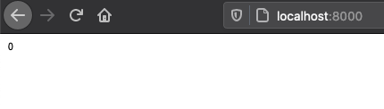

# web-print-1
Dynamic web site which prints Zero

# Pre-requirements

- [pip](https://pypi.org/project/pip/)
- [virtualenv](https://virtualenv.pypa.io/en/latest/)

## Install pre-requirements

Install pip
```bash
curl https://bootstrap.pypa.io/get-pip.py -o get-pip.py
python get-pip.py
```

Install virtualenv
```bash
pip install virtualenv
```

# How to use

```bash
git clone git@github.com:base-line/web-print-1.git
cd web-print-1
```

Create isolated python environment
```bash
virtualenv venv
source venv/bin/activate
(venv) web-print-1
```
Once you see `(venv)` in your beginning of you terminal promt, that means you are working inside your `virtualenv` environment

To exit your virtual environment, run
```bash
deactivate
```

## Run the site
```bash
(venv) web-print-1 $ python server.py
```

check in the browser


as well as output in terminal
```bash
127.0.0.1 - - [05/Aug/2020 11:44:31] "GET / HTTP/1.1" 200 -
```